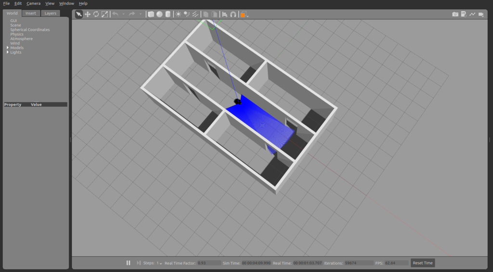
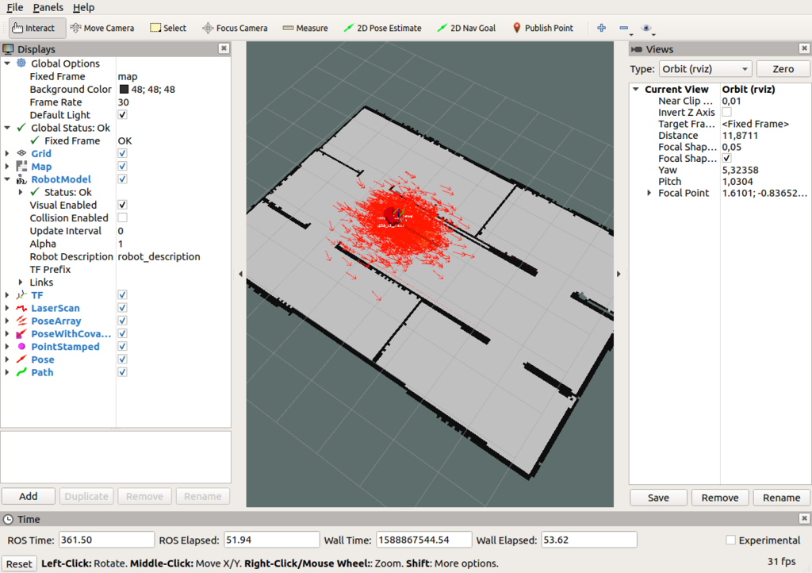
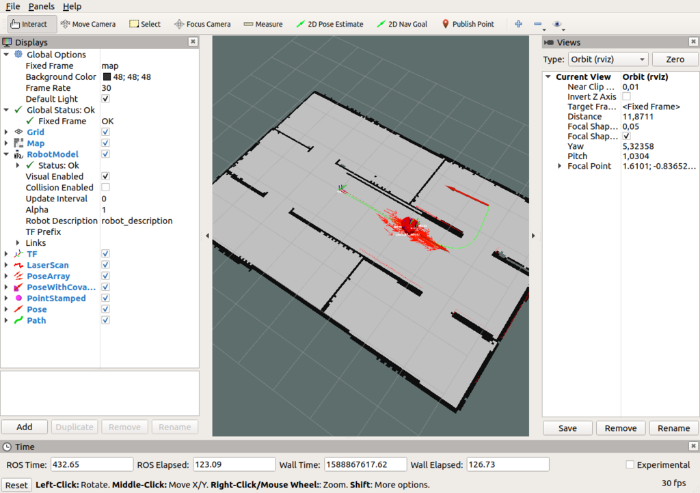
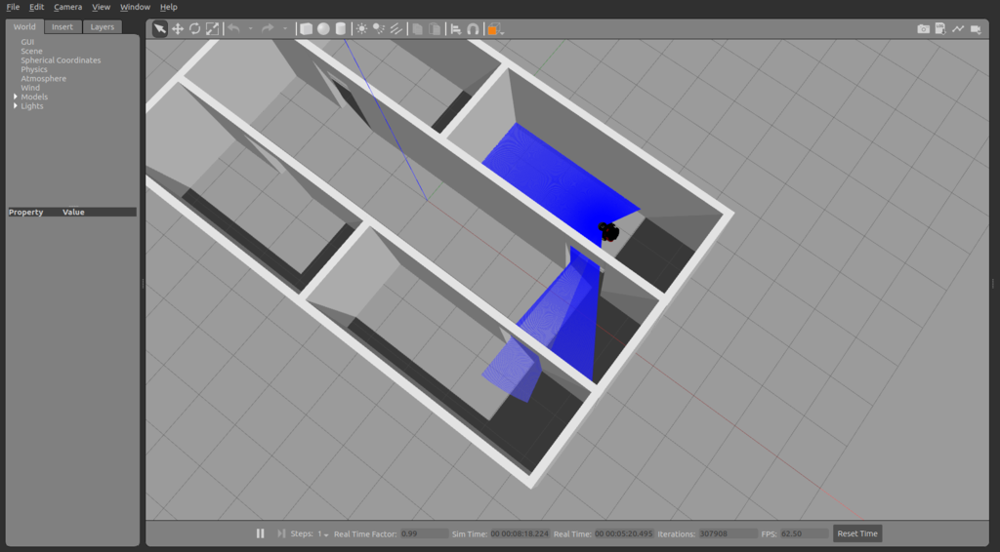

# launching the navigation stack on a simulated robot

First, launch the p3dx.launch file in the p3dx_gazebo package:

```console
foo@bar:~$ source /opt/ros/melodic/setup.bash
foo@bar:~$ source /path/to/catkin_ws/devel/setup.bash
foo@bar:~$ roslaunch p3dx_gazebo pioneer3dx.launch world:=map1_wo_robot
```

Then, in another terminal, launch the navigation.launch file, found in the p3dx_navigation package, passing the **absolute** path to the saved map.yaml file. In case you are using the same world as this tutorial, we already provide the required map file for you as the default argument, inside the maps folder of the package, so you don't need to pass anything. In case you are using another Gazebo world, you will need to use SLAM to generate said map.



```console
foo@bar:~$ source /opt/ros/melodic/setup.bash
foo@bar:~$ source /path/to/catkin_ws/devel/setup.bash
foo@bar:~$ roslaunch p3dx_navigation navigation.launch map_file:=path/to/map.yaml
```

You should now have an rviz window displaying the robot as well as the map file. Now click on the button '2D Pose Estimate' and use the arrow to set the robot's initial pose on the map.

After doing so you should see a particle cloud surrounding the robot. How far appart the particles are from each other indicate the level of uncertainty about the robot's current position on the map.



Now you need to click on the '2D Nav Goal' button, and use the arrow to define the robot's target position on the map. Once you release the arrow you should see the robot's planned path on the map, and it should start moving to reach said goal.



