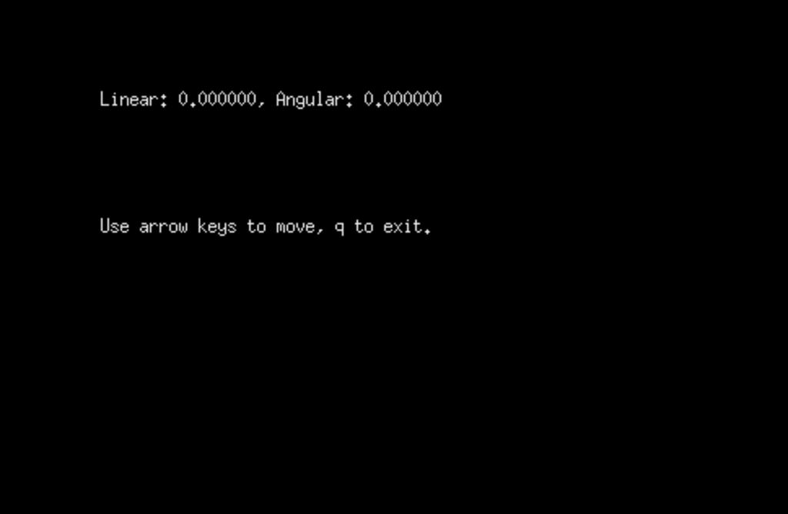

# run slam gmapping on a p3-dx inside gazebo.

First, source your environment and launch pioneer3dx.launch, found inside the package p3dx_gazebo.

```console
foo@bar:~$ source /opt/ros/melodic/setup.bash
foo@bar:~$ source /path/to/catkin_ws/devel/setup.bash
foo@bar:~$ roslaunch p3x_gazebo pioneer3dx.launch world:=map1_wo_robot
```


Then, open another terminal and launch teleop.launch, found inside the package p3dx_teleop. After executing these commands, another window should be opened automatically, where you can send keyboard commands to control the robot's twist.

```console
foo@bar:~$ source /opt/ros/melodic/setup.bash
foo@bar:~$ source /path/to/catkin_ws/devel/setup.bash
foo@bar:~$ roslaunch p3x_teleop teleop.launch
```



Now, you must open another terminal, source your environment, and then launch the slam.launch file, found inside the package p3dx_slam.

```console
foo@bar:~$ source /opt/ros/melodic/setup.bash
foo@bar:~$ source /path/to/catkin_ws/devel/setup.bash
foo@bar:~$ roslaunch p3x_slam slam.launch algorithm:=gmapping
```

You should now be able to see the robot model in rviz, as well as the environment map that is built by the robot as it navigates said environment. Black pixels represent obstacles, while light gray pixels represent space that has already been mapped. The dark gray pixels surrounding the map represent space that has not been mapped.


Now, you must use the teleoperation window to drive the robot around the environment you wish to map, so drive around the world until you are happy with the completness of the generated map.


Once mapping is done, you have to run the map_saver node, found in the map_server package, to save the map somewhere in your filesystem, where it can be used later for autonomous navigation. Open another terminal and run the following commands:

```console
foo@bar:~$ source /opt/ros/melodic/setup.bash
foo@bar:~$ source /path/to/catkin_ws/devel/setup.bash
foo@bar:~$ rosrun map_server map_saver -f /path/to/where/you/want/to/save/the/map
```

You should now have two files inside the folder where you saved the map. One .pgm file, representing the map's occupancy grid, and one .yaml file, with parameters such as the resolution of the map, as well as the path to the .pgm file.

