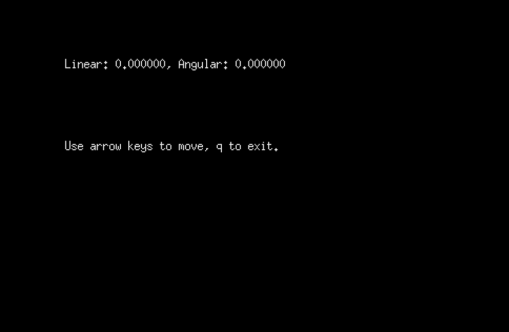

# keyboard teleoperation with gazebo

First, source your environment and launch pioneer3dx.launch, found inside the package p3dx_gazebo.

```console
foo@bar:~$ source /opt/ros/melodic/setup.bash
foo@bar:~$ source /path/to/catkin_ws/devel/setup.bash
foo@bar:~$ roslaunch p3x_gazebo pioneer3dx.launch world:=map1_wo_robot
```


Then, open another terminal and launch teleop.launch, found inside the package p3dx_teleop. After executing these commands, another window should be opened automatically, where you can send keyboard commands to control the robot's twist.

```console
foo@bar:~$ source /opt/ros/melodic/setup.bash
foo@bar:~$ source /path/to/catkin_ws/devel/setup.bash
foo@bar:~$ roslaunch p3x_teleop teleop.launch
```

